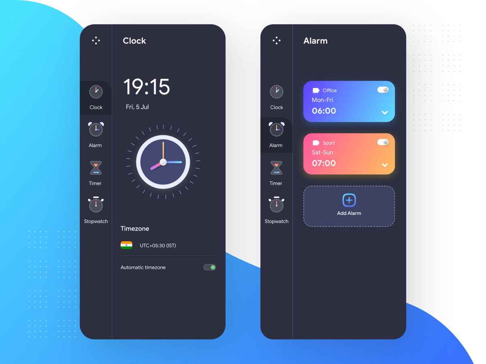

# Clock

## Packages

- sqflite: ^1.3.0
- flutter_local_notifications: ^1.4.4+2
- dotted_border: ^1.0.5
- provider: ^4.1.3
- intl : ^0.16.1
## Languages and Tools:

- [ ](https://code.visualstudio.com/)

-  

-  

-  

## Installation guide

- [Flutter Installation](https://flutter.dev/docs/get-started/install)

## How to run in VS code

1. Open pubspec.yaml file in VS code, click Pub get.
2. Click Run > Start Without Debugging in the main IDE window, or press Ctrl+F5. The status bar turns orange to show you are in a debug session.

## How to run in Android Stdio

1. Click the Play icon in the toolbar, or invoke Run > Run. The bottom Run pane shows logs output.

- for more info [click here](https://flutter.dev/docs/development/tools/android-studio)
